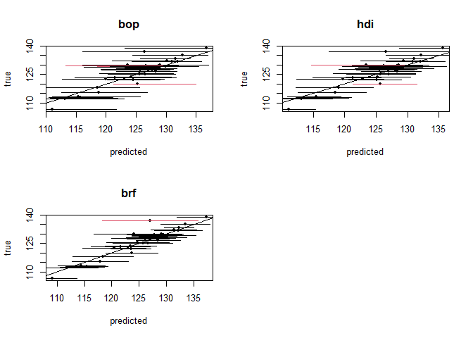

piRF - Prediction Intervals for Random Forests
================
Chancellor Johnstone and Haozhe Zhang

<!-- README.md is generated from README.Rmd. Please edit that file -->


[](https://cran.r-project.org/package=piRF)
[](https://cran.r-project.org/package=piRF)

## Introduction

The goal of *piRF* is to implement multiple state-of-the art random
forest prediction interval methodologies in one complete package.
Currently, the methods implemented can only be utilized within isolated
packages, or the authors have not made a package publicly available. The
package itself utilizes the functionality provided by the *ranger*
package.

## Installation

You can install the released version of *piRF* from
[CRAN](https://CRAN.R-project.org) with:

``` r
install.packages("piRF")
```

And the development version from [GitHub](https://github.com/) with:

``` r
# install.packages("devtools")
devtools::install_github("chancejohnstone/piRF")
```

## Example

This is a basic example which utilizes the *airfoil* dataset included
with *piRF*. The dataset comes from [UCI
Archive](https://archive.ics.uci.edu/ml/datasets/Airfoil+Self-Noise#).
The NASA data set comprises different size NACA 0012 airfoils at various
wind tunnel speeds and angles of attack.

The following functions are not exported by *piRF* but are used for this
example.

``` r
library(piRF)
## basic example code

data(airfoil)
head(airfoil)
#>   freq AoA length velocity       disp pressure
#> 1  800   0 0.3048     71.3 0.00266337  126.201
#> 2 1000   0 0.3048     71.3 0.00266337  125.201
#> 3 1250   0 0.3048     71.3 0.00266337  125.951
#> 4 1600   0 0.3048     71.3 0.00266337  127.591
#> 5 2000   0 0.3048     71.3 0.00266337  127.461
#> 6 2500   0 0.3048     71.3 0.00266337  125.571

#functions to get average length and average coverage of output
getPILength <- function(x){
#average PI length across each set of predictions
l <- x[,2] - x[,1]
avg_l <- mean(l)
return(avg_l)
}

getCoverage <- function(x, response){
  #output coverage for test data
  coverage <- sum((response >= x[,1]) * (response <= x[,2]))/length(response)
  return(coverage)
}
```

Prediction intervals are generated for each of the methods implemented
using train and test datasets constructed from the *airfoil* data.

``` r
method_vec <- c("quantile", "oob", "bcqrf", "cqrf", "bop", "hdi", "brf")

#generate train and test data
set.seed(2020)
ratio <- .975
nrow <- nrow(airfoil)
n <- floor(nrow*ratio)
samp <- sample(1:nrow, size = n)
train <- airfoil[samp,]
test <- airfoil[-samp,]

#generate fitted models
res <- pirf(pressure ~ . , train_data = train,
            method = method_vec,
            concise= FALSE,
            num_threads = 2,
            alpha = .1)

#generate prediction intervals from fitted models
preds <- predict(res, test_data = test)
```

In this example, the *num_threads* option identifies the use of two
cores for parallel processing. The default is to use all available
cores. The *concise* option allows for the output of predictions for the
test observations.

Below are the coverage rates and average prediction interval lengths
using the test dataset. Both are important characteristics of prediction
intervals.

``` r
#empirical coverage, and average prediction interval length for each method
coverage <- sapply(preds$int, FUN = getCoverage, response = test$pressure)
coverage
#>  quantile       oob     bcqrf      cqrf       bop       hdi       brf 
#> 0.8947368 0.8947368 0.8684211 0.8421053 0.8947368 0.8947368 0.9736842
length <- sapply(preds$int, FUN = getPILength)
length
#>  quantile       oob     bcqrf      cqrf       bop       hdi       brf 
#> 10.233720  7.104409  7.344416  9.315674 11.683592  9.893316  9.090353
```

Below are plots of the resulting prediction intervals generated for each
method.

``` r
#plotting intervals and predictions
par(mfrow = c(2,2))
for(i in 1:length(method_vec)){
  #color based on empirical coverage
  col <- ((test$pressure >= preds$int[[i]][,1]) * (test$pressure <= preds$int[[i]][,2])-1)*(-1)+1
   
  plot(x = preds$preds[[i]], y = test$pressure, pch = 20,
      col = "black", ylab = "true", xlab = "predicted", main = method_vec[i])
  abline(a = 0, b = 1)
  segments(x0 = preds$int[[i]][,1], x1 = preds$int[[i]][,2],
           y1 = test$pressure, y0 = test$pressure, lwd = 1, col = col)
}
```



If you find any issues with the package, or have suggestions for
improvements, please let us know.

## References

<div id="refs" class="references csl-bib-body hanging-indent">

<div id="ref-breiman2001random" class="csl-entry">

Breiman, Leo. 2001. “Random Forests.” *Machine Learning* 45 (1): 5–32.
<https://link.springer.com/article/10.1023/A:1010933404324>.

</div>

<div id="ref-ghosal2018boosting" class="csl-entry">

Ghosal, Indrayudh, and Giles Hooker. 2018. “Boosting Random Forests to
Reduce Bias; One-Step Boosted Forest and Its Variance Estimate.” *arXiv
Preprint*. <https://arxiv.org/pdf/1803.08000.pdf>.

</div>

<div id="ref-meinshausen2006quantile" class="csl-entry">

Meinshausen, Nicolai. 2006. “Quantile Regression Forests.” *Journal of
Machine Learning Research* 7 (Jun): 983–99.
<http://www.jmlr.org/papers/volume7/meinshausen06a/meinshausen06a.pdf>.

</div>

<div id="ref-romano2019conformalized" class="csl-entry">

Romano, Yaniv, Evan Patterson, and Emmanuel Candes. 2019. “Conformalized
Quantile Regression.” *arXiv Preprint*.
<https://arxiv.org/pdf/1905.03222v1.pdf>.

</div>

<div id="ref-roy2019prediction" class="csl-entry">

Roy, Marie-Hélène, and Denis Larocque. 2019. “Prediction Intervals with
Random Forests.” *Statistical Methods in Medical Research*.
<https://doi.org/10.1177/0962280219829885>.

</div>

<div id="ref-tung2014bias" class="csl-entry">

Tung, Nguyen Thanh, Joshua Zhexue Huang, Thuy Thi Nguyen, and Imran
Khan. 2014. “Bias-Corrected Quantile Regression Forests for
High-Dimensional Data.” In *2014 International Conference on Machine
Learning and Cybernetics*, 1:1–6. IEEE.
<https://link.springer.com/article/10.1007/s10994-014-5452-1>.

</div>

<div id="ref-zhang2019random" class="csl-entry">

Zhang, Haozhe, Joshua Zimmerman, Dan Nettleton, and Daniel J. Nordman.
2019. “Random Forest Prediction Intervals.” *The American Statistician*,
1–15. <https://doi.org/10.1080/00031305.2019.1585288>.

</div>

<div id="ref-zhu2019hdi" class="csl-entry">

Zhu, Lin, Jiaxin Lu, and Yihong Chen. 2019. “HDI-Forest: Highest Density
Interval Regression Forest.” *arXiv Preprint*.
<https://arxiv.org/pdf/1905.10101.pdf>.

</div>

</div>
