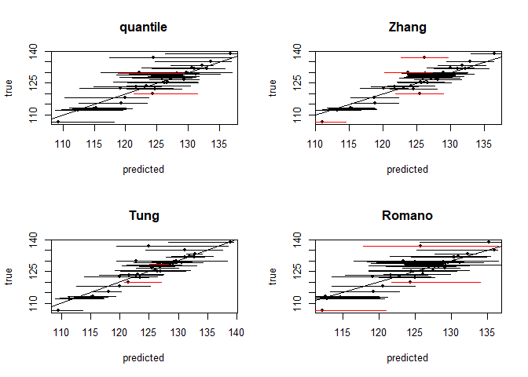
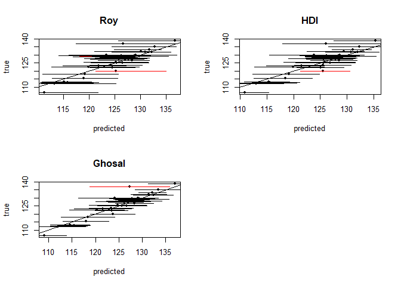

piRF - Prediction Intervals for Random Forests
================
Chancellor Johnstone and Haozhe Zhang

<!-- README.md is generated from README.Rmd. Please edit that file -->
Introduction
------------

<!-- badges: start -->
<!-- badges: end -->
The goal of *piRF* is to implement multiple state-of-the art random forest prediction interval methodologies in one complete package. Currently, the methods implemented can only be utilized within isolated packages, or the authors have not made a package publicly available. The package itself utilizes the functionality provided by the *ranger* package.

Installation
------------

You can install the released version of *piRF* from [CRAN](https://CRAN.R-project.org) with:

``` r
install.packages("piRF")
```

And the development version from [GitHub](https://github.com/) with:

``` r
# install.packages("devtools")
devtools::install_github("chancejohnstone/piRF")
```

Example
-------

This is a basic example which utilizes the *airfoil* dataset included with *piRF*. The dataset comes from [UCI Archive](https://archive.ics.uci.edu/ml/datasets/Airfoil+Self-Noise#). The NASA data set comprises different size NACA 0012 airfoils at various wind tunnel speeds and angles of attack.

The follwoing functions are not exported by *piRF* but are used for this example.

``` r
library(piRF)
## basic example code

data(airfoil)
head(airfoil)
#>   freq AoA length velocity       disp pressure
#> 1  800   0 0.3048     71.3 0.00266337  126.201
#> 2 1000   0 0.3048     71.3 0.00266337  125.201
#> 3 1250   0 0.3048     71.3 0.00266337  125.951
#> 4 1600   0 0.3048     71.3 0.00266337  127.591
#> 5 2000   0 0.3048     71.3 0.00266337  127.461
#> 6 2500   0 0.3048     71.3 0.00266337  125.571

#functions to get average length and average coverage of output
getPILength <- function(x){
#average PI length across each set of predictions
l <- x[,2] - x[,1]
avg_l <- mean(l)
return(avg_l)
}

getCoverage <- function(x, response){
  #output coverage for test data
  coverage <- sum((response >= x[,1]) * (response <= x[,2]))/length(response)
  return(coverage)
}
```

Prediction intervals are generated for each of the methods implemented using train and test datasets constructed from the *airfoil* data.

``` r
method_vec <- c("quantile", "Zhang", "Tung", "Romano", "Roy", "HDI", "Ghosal")
#generate train and test data
set.seed(2020)
ratio <- .975
nrow <- nrow(airfoil)
n <- floor(nrow*ratio)
samp <- sample(1:nrow, size = n)
train <- airfoil[samp,]
test <- airfoil[-samp,]

#generate prediction intervals
res <- rfint(pressure ~ . , train_data = train, test_data = test,
             method = method_vec,
             concise= FALSE,
             num_threads = 2)
```

In this example, the *num\_threads* option identifies the use of two cores for parallel processing. The default is to use all available cores. The *concise* option allows for the output of predictions for the test observations.

Below are the coverage rates and average prediction interval lengths using the test dataset. Both are important characteristics of prediction intervals.

``` r
#empirical coverage, and average prediction interval length for each method
coverage <- sapply(res$int, FUN = getCoverage, response = test$pressure)
coverage
#>  quantile     Zhang      Tung    Romano       Roy       HDI    Ghosal 
#> 0.8947368 0.8947368 0.9210526 0.9210526 0.9473684 0.9473684 0.9736842
length <- sapply(res$int, FUN = getPILength)
length
#>  quantile     Zhang      Tung    Romano       Roy       HDI    Ghosal 
#> 10.233720  7.035656  7.810820 10.578972 11.789397  9.895526  9.097531
```

Below are plots of the resulting prediction intervals generated for each method.

``` r
#plotting intervals and predictions
par(mfrow = c(2,2))
for(i in 1:7){
   col <- ((test$pressure >= res$int[[i]][,1]) *
   (test$pressure <= res$int[[i]][,2])-1)*(-1)+1
   plot(x = res$preds[[i]], y = test$pressure, pch = 20,
      col = "black", ylab = "true", xlab = "predicted", main = method_vec[i])
   abline(a = 0, b = 1)
   segments(x0 = res$int[[i]][,1], x1 = res$int[[i]][,2],
      y1 = test$pressure, y0 = test$pressure, lwd = 1, col = col)
}
```



If you find any issues with the package, or have suggestions for improvements, please let us know.

References
----------

Breiman, Leo. 2001. “Random Forests.” *Machine Learning* 45 (1). Springer: 5–32. <https://link.springer.com/article/10.1023/A:1010933404324>.

Ghosal, Indrayudh, and Giles Hooker. 2018. “Boosting Random Forests to Reduce Bias; One-Step Boosted Forest and Its Variance Estimate.” *ArXiv Preprint*. <https://arxiv.org/pdf/1803.08000.pdf>.

Meinshausen, Nicolai. 2006. “Quantile Regression Forests.” *Journal of Machine Learning Research* 7 (Jun): 983–99. <http://www.jmlr.org/papers/volume7/meinshausen06a/meinshausen06a.pdf>.

Romano, Yaniv, Evan Patterson, and Emmanuel Candes. 2019. “Conformalized Quantile Regression.” *ArXiv Preprint*. <https://arxiv.org/pdf/1905.03222v1.pdf>.

Roy, Marie-Hélène, and Denis Larocque. 2019. “Prediction Intervals with Random Forests.” *Statistical Methods in Medical Research*. SAGE Publications Sage UK: London, England. <https://doi.org/10.1177/0962280219829885>.

Tung, Nguyen Thanh, Joshua Zhexue Huang, Thuy Thi Nguyen, and Imran Khan. 2014. “Bias-Corrected Quantile Regression Forests for High-Dimensional Data.” In *2014 International Conference on Machine Learning and Cybernetics*, 1:1–6. IEEE. <https://link.springer.com/article/10.1007/s10994-014-5452-1>.

Zhang, Haozhe, Joshua Zimmerman, Dan Nettleton, and Daniel J. Nordman. 2019. “Random Forest Prediction Intervals.” *The American Statistician*. Taylor & Francis, 1–15. <https://doi.org/10.1080/00031305.2019.1585288>.

Zhu, Lin, Jiaxin Lu, and Yihong Chen. 2019. “HDI-Forest: Highest Density Interval Regression Forest.” *ArXiv Preprint*. <https://arxiv.org/pdf/1905.10101.pdf>.
